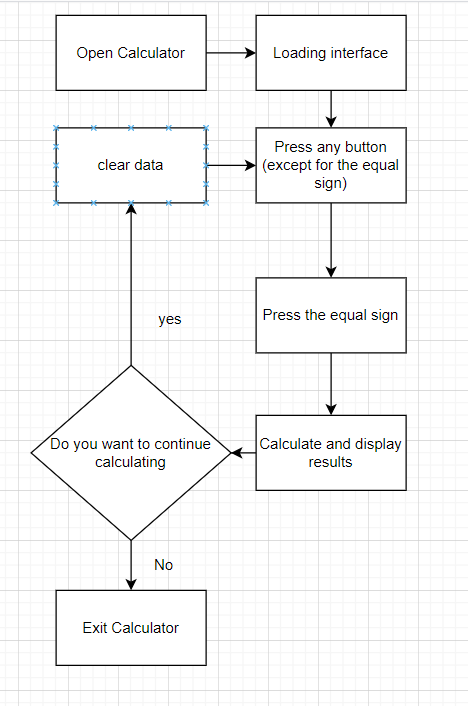

# Visual Calculator Based on Python
# Assignment Table
| The Link Your Class |https://bbs.csdn.net/forums/ssynkqtd-04 |
| ----------------- |--------------- |
| The Link of Requirement of This Assignment | https://bbs.csdn.net/topics/617332156 |
| The Aim of This Assignment | Implement the basic functions of a scientific calculator and have a beautiful UI design |
| MU STU ID and FZU STU ID |21125783_832102229 |
# PSP Table
| Personal Software Process Stages   | Estimated Time（minutes） | Actual Time（minutes） |
| :-------------------------------------- | :------------------------ | :--------------------- |
| Planning                                |       20                    |                  30      |
| • Estimate                              |        20                   |  30                      |
| Development                             |   490                        |          725              | 
| • Analysis                              |       120                    |                100        |
| • Design Spec                           |    30                       |                    20    |
| • Design Review                         |      20                     |               20         |
| • Coding Standard                       |    15                       |          20              |
| • Design                                |   30                        |           35             |
| • Coding                                |  180                         |                  260      |
| • Code Review                           |          20                 |               30         |
| • Test                                  |    120                       |       240                 |
| Reporting                               |         190                  |                230        |
| • Test Repor                            |  120                         |       130                 |
| • Size Measurement                      |        10                   |                    10    |
| • Postmortem & Process Improvement Plan |       60                    |             90           |
| Sum                                 |   700                        |                985        |
# Task objectives and realization ideas
## Task objectives
Implement a scientific calculator with basic operations as well as trigonometric and power function operations.
## Realization ideas
### 1 Preliminary ideas
Implementing this calculator requires a visual interface and calculation functions. Python not only has its powerful computing capabilities, but also the Tkinter library can easily create visual interfaces. At the same time, Python is very concise, so I plan to use Python to complete this project.
### 2 Search for information
I use CSDN to search for the information I need
# Design and implementation process
The design of the calculator is divided into several parts：
## Visual Interface
In this section, Tkinter can quickly design the required visual interface and adjust it according to preferences
## Interactive button logic
Design interactive buttons. When a user clicks a button, a function bound to the button is triggered to input the value corresponding to the button onto the screen. When the user presses the equals sign, the function calculates all values.
## Calculation logic
Python has a powerful built-in function: eval(). This function accepts an arithmetic expression in the form of a string and returns the value evaluated by the expression. This function can greatly simplify the calculation process, allowing us to only focus on designing expressions. However, incorrect expressions can lead to system errors. Therefore, we need to design possible user expressions correctly and add try-catch to prevent crashes caused by system errors.
In addition, eval() accepts expressions in Python form, not in human form. For example, except for/instead of ÷, and the sine function being numpy. sin() instead of sin, it is necessary to construct expressions for eval() and expressions presented on the screen separately.
## flow chat

# Code Description
## Interface initialization
``` python
import tkinter as tk  #引用tkinter库以进行GUI编辑
import unicodeit
import numpy as np
import math
window = tk.Tk()
window.title("Calculator")

#Center display
sw = window.winfo_screenwidth()  #Width
sh = window.winfo_screenheight()
ww = 500
wh = 500
x = (sw-ww) / 2
y = (sh-wh) / 2
window.geometry("%dx%d+%d+%d" %(ww,wh,x,y)) 


window.attributes("-alpha", 0.9)
window["background"] = "black"
#Set the background, color, and transparency of the window

font1=("黑体",25)
font2 = ("黑体", 15)
#Define two font formats that will be used later, one for the result line font font1 and one for the button font font2

```
## Set hidden and displayed formulas
``` pyhton
res_all = tk.StringVar()#Overall results
res_all.set("")
res_back= tk.StringVar()#Hidden calculation formula
res_back.set("")
#Create the variable res so that the final result line can change with the input of the button

label = tk.Label(window, textvariable=res_all, height=2,font=font1,fg="white", bg="black", width=27, justify=tk.LEFT, anchor=tk.SE)
label.grid(row=1, column=1, columnspan=5)
#Summary Results Line
```
## Set button images and text
``` python

button_2nd = tk.Button(window, text="2nd", width=5, font=font2, fg="white",relief=tk.FLAT, bg="grey")#Keys for switching between functions and inverse functions
button_pai = tk.Button(window, text="π", width=5, font=font2, fg="white",relief=tk.FLAT, bg="grey")#Constant π
button_e = tk.Button(window, text="e", width=5, font=font2, fg="white",relief=tk.FLAT, bg="grey")#Constant e
button_C = tk.Button(window, text="C", width=5, font=font2, fg="white",relief=tk.FLAT, bg="grey")#Clear all characters
button_back = tk.Button(window, text="⬅", width=5, font=font2, fg="white",relief=tk.FLAT, bg="grey")#Delete a character
button_2nd.grid(row=2, column=1, padx=3, pady=2)
button_pai.grid(row=2, column=2, padx=3, pady=2)
button_e.grid(row=2, column=3, padx=3, pady=2)
button_C.grid(row=2, column=4, padx=3, pady=2)
button_back.grid(row=2, column=5, padx=3, pady=2)

button_sin = tk.Button(window, text="sin", width=5, font=font2, fg="white",relief=tk.FLAT, bg="grey")#Sine function
button_lc = tk.Button(window, text="(", width=5, font=font2, fg="white",relief=tk.FLAT, bg="grey")#Left parenthesis
button_rc = tk.Button(window, text=")", width=5, font=font2, fg="white",relief=tk.FLAT, bg="grey")#Right parenthesis
button_pow = tk.Button(window, text=unicodeit.replace("x^y"), width=5, font=font2, fg="white",relief=tk.FLAT, bg="grey")#Power function
button_div = tk.Button(window, text="÷", width=5, font=font2, fg="white",relief=tk.FLAT, bg="grey")#Division sign
button_sin.grid(row=3, column=1, padx=3, pady=2)
button_lc.grid(row=3, column=2, padx=3, pady=2)
button_rc.grid(row=3, column=3, padx=3, pady=2)
button_pow.grid(row=3, column=4, padx=3, pady=2)
button_div.grid(row=3, column=5, padx=3, pady=2)


button_cos = tk.Button(window, text="cos", width=5, font=font2, fg="white",relief=tk.FLAT, bg="grey")#Cosine function
button_7 = tk.Button(window, text="7", width=5, font=font2, fg="white",relief=tk.FLAT, bg="grey")#7
button_8 = tk.Button(window, text="8", width=5, font=font2, fg="white",relief=tk.FLAT, bg="grey")#8
button_9 = tk.Button(window, text="9", width=5, font=font2, fg="white",relief=tk.FLAT, bg="grey")#9
button_mul = tk.Button(window, text="×", width=5, font=font2, fg="white",relief=tk.FLAT, bg="grey")#Multiplication sign
button_cos.grid(row=4, column=1, padx=3, pady=2)
button_7.grid(row=4, column=2, padx=3, pady=2)
button_8.grid(row=4, column=3, padx=3, pady=2)
button_9.grid(row=4, column=4, padx=3, pady=2)
button_mul.grid(row=4, column=5, padx=3, pady=2)


button_tan = tk.Button(window, text="tan", width=5, font=font2, fg="white",relief=tk.FLAT, bg="grey")#Tangent function
button_4 = tk.Button(window, text="4", width=5, font=font2, fg="white",relief=tk.FLAT, bg="grey")#4
button_5 = tk.Button(window, text="5", width=5, font=font2, fg="white",relief=tk.FLAT, bg="grey")#5
button_6 = tk.Button(window, text="6", width=5, font=font2, fg="white",relief=tk.FLAT, bg="grey")#6
button_dec = tk.Button(window, text="-", width=5, font=font2, fg="white",relief=tk.FLAT, bg="grey")#Minus sign
button_tan.grid(row=5, column=1, padx=3, pady=2)
button_4.grid(row=5, column=2, padx=3, pady=2)
button_5.grid(row=5, column=3, padx=3, pady=2)
button_6.grid(row=5, column=4, padx=3, pady=2)
button_dec.grid(row=5, column=5, padx=3, pady=2)


button_sec = tk.Button(window, text="sec", width=5, font=font2, fg="white",relief=tk.FLAT, bg="grey")#sec function
button_1 = tk.Button(window, text="1", width=5, font=font2, fg="white",relief=tk.FLAT, bg="grey")#1
button_2 = tk.Button(window, text="2", width=5, font=font2, fg="white",relief=tk.FLAT, bg="grey")#2
button_3 = tk.Button(window, text="3", width=5, font=font2, fg="white",relief=tk.FLAT, bg="grey")#3
button_plu = tk.Button(window, text="+", width=5, font=font2, fg="white",relief=tk.FLAT, bg="grey")#Plus sign
button_sec.grid(row=6, column=1, padx=3, pady=2)
button_1.grid(row=6, column=2, padx=3, pady=2)
button_2.grid(row=6, column=3, padx=3, pady=2)
button_3.grid(row=6, column=4, padx=3, pady=2)
button_plu.grid(row=6, column=5, padx=3, pady=2)


button_cot = tk.Button(window, text="cot", width=5, font=font2, fg="white",relief=tk.FLAT, bg="grey")#cot function
button_np = tk.Button(window, text="n!", width=5, font=font2, fg="white",relief=tk.FLAT, bg="grey")#Factorial
button_0 = tk.Button(window, text="0", width=5, font=font2, fg="white",relief=tk.FLAT, bg="grey")#0
button_dot = tk.Button(window, text=".", width=5, font=font2, fg="white",relief=tk.FLAT, bg="grey")#dot
button_equ = tk.Button(window, text="=", width=5, font=font2, fg="white",relief=tk.FLAT, bg="grey")#Equal sign
button_cot.grid(row=7, column=1, padx=3, pady=2)
button_np.grid(row=7, column=2, padx=3, pady=2)
button_0.grid(row=7, column=3, padx=3, pady=2)
button_dot.grid(row=7, column=4, padx=3, pady=2)
button_equ.grid(row=7, column=5, padx=3, pady=2)
```
## Set the function of the button for switching functions and inverse functions
``` python
state=0
def change_power():#function for switching between functions and inverse functions
    global state
    if state==0:#2nd not pressed
        button_2nd.config(fg='white',bg='blue')
        button_sin.config(text=unicodeit.replace("sin^{-1}"))
        button_cos.config(text=unicodeit.replace("cos^{-1}"))
        button_tan.config(text=unicodeit.replace("tan^{-1}"))
        button_sec.config(text=unicodeit.replace("sec^{-1}"))
        button_cot.config(text=unicodeit.replace("cot^{-1}"))
        state=1
    else:#2nd pressed
        button_2nd.config(fg='white',bg='grey')
        button_sin.config(text="sin")
        button_cos.config(text="cos")
        button_tan.config(text="tan")
        button_sec.config(text="sec")
        button_cot.config(text="cot")
        state=0
```
## Clear, delete, and automatically delete after calculation is completed
``` python
clack=0#Indicates whether equal sign calculation has been performed and whether there is still content in the label
def buttonclick(x1,x2):#Automatically clear current content after calculation
    global clack
    if clack==1:
        res_back.set("")
        res_all.set("")
        clack=0
    b=res_all.get()
    if len(b)>=25:return
    c=res_back.get()
    res_back.set(c+x2)
    res_all.set(b+x1)

def clear():#Delete all characters
    res_back.set("")
    res_all.set("")

def back():#Delete a character
    global clack
    if clack==1:
        res_back.set("")
        res_all.set("")
        clack=0
    b=res_all.get()
    if len(b)>=25:return
    c=res_back.get()
    res_back.set(c[0:-1])
    res_all.set(b[0:-1])
```
## Calculating trigonometric functions
``` python
def buttonclick_tr(x):#Processing trigonometric functions
    global clack
    if clack==1:
        res_back.set("")
        res_all.set("")
        clack=0
    ans1=""
    ans2=""
    b=res_all.get()
    if len(b)>=25:return
    c=res_back.get()
    global state
    if state==0:
        if x==1:
            ans1=ans1+'sin('
            ans2=ans2+'np.sin(np.pi/180*'
        if x==2:
            ans1=ans1+'cos('
            ans2=ans2+'np.cos(np.pi/180*'
        if x==3:
            ans1=ans1+'tan('
            ans2=ans2+'np.tan(np.pi/180*'           
        if x==4:
            ans1=ans1+'sec('
            ans2=ans2+'np.sec(np.pi/180*'
        if x==5:
            ans1=ans1+'cot('
            ans2=ans2+'np.cot(np.pi/180*'
    else:
        if x==1:
            ans1=ans1+unicodeit.replace("sin^{-1}(")
            ans2=ans2+'180/np.pi*np.arcsin('
        if x==2:
            ans1=ans1+unicodeit.replace("cos^{-1}(")
            ans2=ans2+'180/np.pi*np.arccos('
        if x==3:
            ans1=ans1+unicodeit.replace("tan^{-1}(")
            ans2=ans2+'180/np.pi*np.arctan('           
        if x==4:
            ans1=ans1+unicodeit.replace("sec^{-1}(")
            ans2=ans2+'180/np.pi*np.arcsec('
        if x==5:
            ans1=ans1+unicodeit.replace("cot^{-1}(")
            ans2=ans2+'180/np.pi*np.arccot('
    res_back.set(c+ans2)
    res_all.set(b+ans1)
```
## A program for calculating factorial
``` python
def buttonclick_fac():#Process Factorial
    global clack
    if clack==1:
        res_back.set("")
        res_all.set("")
        clack=0
    b=res_all.get()
    if len(b)>=25:return
    c=res_back.get()
    res_all.set(b+'!')
    i=len(b)-1
    now=""
    while i>=0 and b[i]<='9' and b[i]>='0':
        now=b[i]+now
        i=i-1
    res_back.set(c[0:i]+"math.factorial("+now+")")
```
## Program for calculating equal to sign
``` python
def eqa():#Calculate final value
    global clack
    b=res_all.get()
    c=res_back.get()
    try:
        ans = eval(c) #The eval function is used to calculate the final value of the entire hidden expression
        x=str(ans)
        if len(x)>25:x=x[0:25]
        res_all.set(x)
        res_back.set(x)
    except (ZeroDivisionError): 
        res_all.set(str('Error: 除零错误'))
    except NameError:
        res_all.set(str('Error: 请加上括号'))
    except SyntaxError:
        res_all.set(str('Error: 语法错误，请正确输入'))
    clack=1
```
## Bind functions to buttons
``` python
button_2nd.config(command=lambda: change_power())
button_pai.config(command=lambda: buttonclick("π","np.pi"))
button_e.config(command=lambda: buttonclick("e","np.exp(1)"))
button_C.config(command=lambda: clear())
button_back.config(command=lambda: back())
button_sin.config(command=lambda: buttonclick_tr(1))
button_lc.config(command=lambda: buttonclick("(","("))
button_rc.config(command=lambda: buttonclick(")",")"))
button_pow.config(command=lambda: buttonclick("^","**"))#In Python, * * is a power operation symbol
button_div.config(command=lambda: buttonclick("÷","/"))
button_cos.config(command=lambda: buttonclick_tr(2))
button_7.config(command=lambda: buttonclick("7","7"))
button_8.config(command=lambda: buttonclick("8","8"))
button_9.config(command=lambda: buttonclick("9","9"))
button_mul.config(command=lambda: buttonclick("×","*"))
button_tan.config(command=lambda: buttonclick_tr(3))
button_4.config(command=lambda: buttonclick("4","4"))
button_5.config(command=lambda: buttonclick("5","5"))
button_6.config(command=lambda: buttonclick("6","6"))
button_dec.config(command=lambda: buttonclick("-","-"))
button_sec.config(command=lambda: buttonclick_tr(4))
button_3.config(command=lambda: buttonclick("3","3"))
button_2.config(command=lambda: buttonclick("2","2"))
button_1.config(command=lambda: buttonclick("1","1"))
button_plu.config(command=lambda: buttonclick("+","+"))
button_sec.config(command=lambda: buttonclick_tr(5))
button_np.config(command=lambda: buttonclick_fac())
button_0.config(command=lambda: buttonclick("0","0"))
button_dot.config(command=lambda: buttonclick(".","."))
button_equ.config(command=lambda: eqa())
```
# Specific demonstration

# Summary and possible future improvements
## Limitations
This calculator does not have a historical data query function and cannot help users better use the calculator.
The display screen size of this calculator is 25 characters, meaning expressions exceeding 25 characters cannot be entered. This creates certain limitations.
## Future Plans
Add historical query function for greater user convenience
Add a character size that can automatically adapt to the number of words, reducing it to increase the number of words when there are many
Add a double-layer display screen, one layer for displaying the current number and one layer for displaying the results
Simplify code: Use a for loop to create all buttons at once
Encapsulation into Class: Encapsulates buttons into classes for easy addition and invocation
# In the last
Firstly, I learned how to use Tkinter to create a simple desktop application. Tkinter is a powerful tool that allows developers to easily build Tkinter applications. By learning how to design interfaces, add controls, handle user input, and master basic tkenter concepts, I am able to create a basic calculator application.
In addition, by documenting my project experience, I have improved my communication and sharing skills. Blogging is a great way to share my thoughts and experiences with others. By clearly articulating my ideas, I can help others understand how to create a simple tkenter application and share my learning process and findings. It also helps me better understand and summarize my work, improving my programming skills.
In summary, this project has enabled me to learn a lot about interface and software management issues, accumulating more experience for future projects
# github link
https://github.com/wearecomming/lab1_calculator_base_on_tkinter